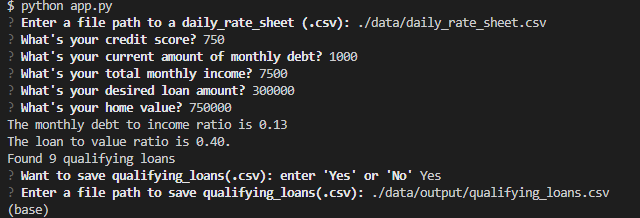

# Loan Qualifier Application

This is a python command-line interface application that allows users to see qualifying loans from lenders quickly and easily. The application works by that taking in a `daily_rate_sheet` of loan criteria from various loan providers, asks the user a number of questions to evaluate their loan eligibility, and then returns to them a list of qualifying loans.  Then the user is given the choice to opt to saving the file by providing a file path or simply exit the application.

---


## Technologies

This project leverages python 3.7 with the following packages:

* [fire](https://github.com/google/python-fire) - For the command line interface, help page, and entrypoint.

* [questionary](https://github.com/tmbo/questionary) - For interactive user prompts and dialogs

* [pytest](https://docs.pytest.org/en/stable/) - For basic assertion testing of financial calculators and filters, and filio.


---

## Installation Guide

Before running the application first install the following dependencies.

```python
  pip install fire
  pip install questionary
  pip install pytest
  pip install mkdocs
```

---

## Examples

This section should include screenshots, code blocks, or animations showing how your project works.

---

## Usage

To use the loan qualifier application simply clone the repository and run the **app.py** with:

```python
python app.py
```
Upon launching the loan qualifier application you will be greeted with the following prompts.


---

## Contributors

Brought to you by Carlos R. you may reach me at reachcarlostoday@gmail.com

---

## License

MIT.
